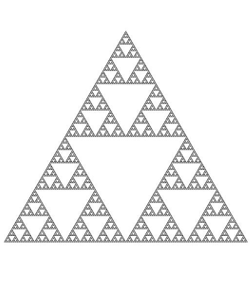

# L-Systems in Rust

This is just a practise implementation of [L-Systems](https://en.wikipedia.org/wiki/L-system) in Rust.

Currently, Rust's type system isn't being used to its greatest potential here. That may change in the future.

## Examples
### Algae (examples/algae.rs)
This is based off of Lindenmayer's original L-System for modelling the growth of algae, described [here](https://en.wikipedia.org/wiki/L-system#Example_1:_algae).

**Rules:** \
**A** -> AB \
**B** -> A

**Axiom:** A

**Produces:**\
**n = 0:** A \
**n = 1:** AB \
**n = 2:** ABA \
**n = 3:** ABAAB \
**n = 4:** ABAABABA \
**n = 5:** ABAABABAABAAB \
**n = 6:** ABAABABAABAABABAABABA

**Code:**
```rs
use lsystem::{lsystem::LSystem, rules::Rules};

fn main() {
    /* Setup */
    let mut rules = Rules::<char>::new();
    rules.set('A', vec!['A', 'B']);
    rules.set('B', vec!['A']);

    let axiom = &['A'];
    let system = LSystem::<char>::new(rules.clone(), axiom);

    /* Printing context */
    println!("Rules:\n{}\n", rules);
    println!(
        "Axiom: {}\n",
        axiom
            .iter()
            .map(|a| a.to_string())
            .collect::<Vec<_>>()
            .join("")
    );

    /* Iterating */
    println!("Produces:");

    let generations = system.take(7).collect::<Vec<_>>();

    for (n, s) in generations.iter().enumerate() {
        println!("n = {} : {}", n, s.iter().collect::<String>());
    }
}
```

### Sierpinski triangle (examples/sierpinski_triangle.rs)
This will generate a sequence of characters that can be interpreted to draw a Sierpinski triangle fractal, described [here](https://en.wikipedia.org/wiki/L-system#Example_5:_Sierpinski_triangle).

**Rules:** \
**G** -> GG \
**F** -> F-G+F+G-F

**Axiom:** F-G-G

**Code:**
```rs
use lsystem::{lsystem::LSystem, rules::Rules};

fn main() {
    /* Setup */
    let mut rules = Rules::<char>::new();
    rules.set('F', vec!['F', '-', 'G', '+', 'F', '+', 'G', '-', 'F']);
    rules.set('G', vec!['G', 'G']);

    let axiom = &['F', '-', 'G', '-', 'G'];
    let system = LSystem::<char>::new(rules.clone(), axiom);

    /* Printing context */
    println!("Rules:\n{}\n", rules);
    println!(
        "Axiom: {}\n",
        axiom
            .iter()
            .map(|a| a.to_string())
            .collect::<Vec<_>>()
            .join("")
    );

    /* Iterating */
    println!("Produces:");

    let generations = system.take(7).collect::<Vec<_>>();

    for (n, s) in generations.iter().enumerate() {
        println!("n = {} : {}", n, s.iter().collect::<String>());
    }
}
```

**Produces:** \
**n = 0:** F-G+F+G-F-GG-GG \
**n = 1:** F-G+F+G-F-GG+F-G+F+G-F+GG-F-G+F+G-F-GGGG-GGGG \
**n = 2:** F-G+F+G-F-GG+F-G+F+G-F+GG-F-G+F+G-F-GGGG+F-G+F+G-F-GG+F-G+F+G-F+GG-F-G+F+G-F+GGGG-F-G+F+G-F-GG+F-G+F+G-F+GG-F-G+F+G-F-GGGGGGGG-GGGGGGGG \
***(...)***

Example rendering using the program's output:

